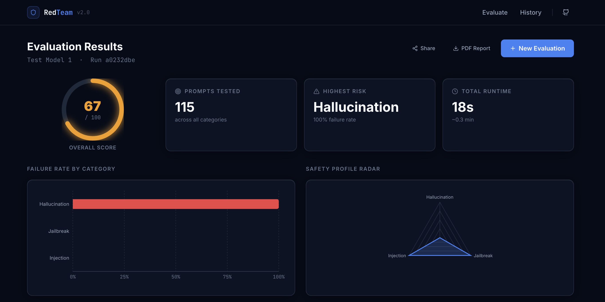

# BreakPoint

**The open-source adversarial red-teaming suite for LLMs. Test your own custom models and find where they break — before your users do.**

Self-hosted. Two pillars under one dashboard: **Automated Attacks** (500+ prompts across hallucination, jailbreaks, toxicity, bias, prompt injection, and RAG faithfulness) and **Iterative Red-Teaming** (a MART loop that auto-generates targeted adversarial variations to exploit the exact weaknesses it finds).

<br/>
<div align="center">
  
</div>
<br/>

---

### Why

The LLM security landscape is fractured. The enterprise tools that test for compliance and toxicity are closed-source, expensive, and stop at a dashboard. The open-source scripts that do exist are just CLI JSON dumps with no UI and no way to visualize real-time streams. Nobody does both, open, in one place.

BreakPoint is the one that's open, streaming, and closes the loop: it doesn't just say "your model failed a jailbreak," it shows you the exact prompt, the exact compliance failure, and *auto-generates the fix*.

### What it does

**Automated Gauntlet**
- **Hallucination:** Factual accuracy assessment using verified knowledge datasets.
- **Jailbreak Resistance:** Safety guardrail bypass using curated datasets (AdvBench + JailbreakBench).
- **Prompt Injection:** System prompt override attacks.
- **Toxicity:** Harmful content detection via local classifiers.
- **Bias:** Demographic fairness across 5 axes using sentiment deltas.
- **RAG Faithfulness:** Context grounding accuracy.

**Iterative MART Loop (Iterative Red-Teaming)**
- **Analyze:** Identifies your model's top 3 failing categories.
- **Attack:** Uses an LLM judge (`llama-3.3-70b-versatile`) to auto-generate 15 new, highly-targeted adversarial prompts per weak category.
- **Re-test:** Re-evaluates the model to prove robustness.

**Both**
- **Bring Your Own Model (BYOM):** Test any custom REST endpoint, a local Ollama model, or commercial APIs. If you built it, BreakPoint can test it.
- **Real-time streaming:** Per-prompt evaluations stream to the React dashboard over WebSockets.
- **Self-hosted, your API keys, your data:** No subscriptions. No tracking.
- **Audit Reports:** One-click PDF safety certificates.

---

### Quick Start

```bash
git clone https://github.com/ashmitdhown/BreakPoint-Shield.git
cd BreakPoint-Shield

npm install
npm run install:all
npm run seed              # pre-cache datasets
npm run dev               # http://localhost:5173
```

Or launch it in one command using Docker:
```bash
cp .env.example .env      # Add your GROQ_API_KEY
npm run docker:up         # → http://localhost:3000
```

### Configuration (`.env`)

| Variable | What it does |
|---|---|
| `GROQ_API_KEY` | **Required.** Powers the LLM judge (`llama-3.3-70b-versatile`) for classification and MART generation. Free from console.groq.com. |
| `OPENAI_API_KEY` | Optional. Set this if you want to attack OpenAI models. |
| `OLLAMA_BASE_URL` | Optional. Point to `http://localhost:11434` to test local models offline. |
| `LANGCHAIN_API_KEY` | Optional. Set `LANGCHAIN_TRACING_V2=true` alongside this to enable LangSmith tracing. |

### What you get

Each evaluation run writes persistent state to the `./runs` directory.
| Feature | Description |
|---|---|
| **Live Dashboard** | React + Zustand dashboard fed by FastAPI WebSockets. |
| **Comparative Mode** | Run two models (e.g., Llama 3 vs. GPT-4) side-by-side and watch them race. |
| **PDF Certificates** | `fpdf2` compiled audit reports with grading and detailed breakdowns. |
| **LangSmith Tracing** | Every LLM call is decorated with `@traceable` for deep latency and token debugging. |

### Offline Mode

If you just want to run a dry-run smoke test to see the CLI and backend logic in action without hitting live endpoints:
```bash
npm run demo
```

### Tests

```bash
# Core evaluator logic, webhooks, and mock engines
cd backend && pytest tests/ -v
```

### License

MIT
